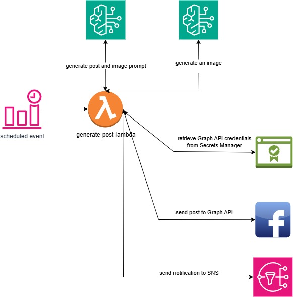

# MomentsInHistory 🕰️

**MomentsInHistory** is an automated, AI-powered application that generates and posts historical event content (both text and images) to Facebook. 

Leveraging the power of **Amazon Bedrock** foundation models, the system uses advanced AI to craft engaging historical narratives and generate accompanying visuals dynamically. The application is fully serverless, running on **AWS Lambda** with the latest Python runtime, and is orchestrated using **AWS EventBridge** for scheduled, hands-free execution. Upon successful completion of each posting cycle, it sends an email notification using **AWS SNS**. All infrastructure components are provisioned and managed using **Terraform** for streamlined deployment and infrastructure consistency. Deployment and CI/CD workflows are automated via **GitHub Actions**, ensuring seamless and repeatable releases.

---

## 🚀 Features  
- 📌 Generates posts about **historical events** with accompanying images using **Amazon Bedrock** foundation models  
- 📌 Automatically publishes generated content to **Facebook**  
- 📌 **Scheduled execution** via AWS EventBridge (e.g., daily posts)  
- 📌 **Email notifications** sent via AWS SNS upon completion  
- 📌 Fully **serverless** using AWS Lambda with the latest Python runtime  
- 📌 Infrastructure managed with Terraform for easy deployment and consistency  

---

## 🛠️ Tech Stack  
- **AWS Lambda** – Python-based serverless backend  
- **Amazon Bedrock** – foundation models powering automatic generation of historical posts and images  
- **AWS EventBridge** – scheduled execution of Lambda  
- **AWS SNS** – email notifications after execution  
- **Terraform** – infrastructure as code (IaC)  
- **AWS Services** – S3, CloudWatch, IAM, etc.  
- **Facebook Graph API** – posting content to Facebook  

---

## 📦 Installation & Deployment

### Prerequisites
- AWS account and configured AWS CLI  
- Terraform installed
- Python 3.10+ (for local development and Lambda packaging)  
- Facebook API credentials (App ID, App Secret, Access Tokens)

## ⚠️ Common Issues

### Facebook Graph API Posts Not Appearing on Fanpage Feed

**Symptom:**  
Posts and photos sent via the Facebook Graph API are successfully created (no error response), but they do not show up in the fanpage's visible feed or timeline.

## 📊 Architecture Diagram
